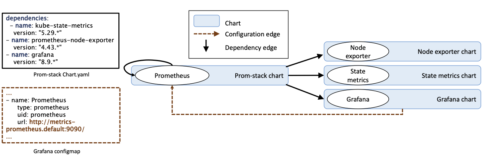

# How it works
Helm-ET use the application's configuration to manage the allowed communication within the cluster. It does not need to run the application or access to the source code. Instead, it gets all the information needed from the Helm Chart and/or the YAML configuration, including environment variables and ConfigMaps.
Helm-ET generates plain NetworkPolicy objects by creating and combining two connectivity graphs, each one representing a different view of the application:

- **Implicit connectivity graph:** this graph is built analyzing the application structure, its dependencies and hierarchy. For example, all pods from a Chart can connect to all the pods dependending on them but, pods in the dependency cannot start connections to other parts of the cluster.
- **Explicit connecitivy graph:** this graph is built by checking values passed to the pods as environment variables, ConfigMaps, etc. It includes connections between components (i.e., labels and selector combinations) and connections to the K8s APIServer.

## How Helm-ET generates policies
For every component 'c' of the chart:
- It allows connections from the component to itself.
- For all the compute units on the dependencies of 'c', it allows egress to the dependency compute units and corresponding service.
- If 'c' is a dependency, it allows ingress access from 'c' ancestors.
- It allows egress to the ClusterDns and to the Internet*.
- For those connections explicit in the chart configurations, allow ingress and egress accordingly.
- If the component requires access to the K8s Api Server, add egress rules.

*Helm-ET creates network policies to manage communication within the cluster. That's why by default connections to the internet are allowed. To change it, you can customize the policies.

## How policies can be customized
